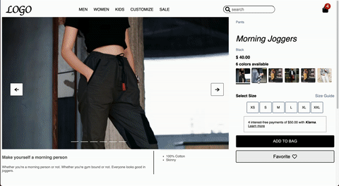
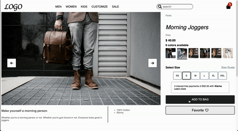
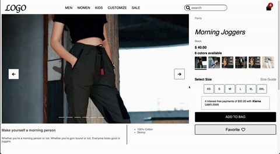
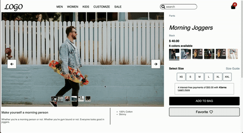

## Project-Catwalk

### Technologies

## Features

### Mobile responsive
* Adjust content size and layout by screen size.

### Product overview
* Render product details and available styles.

* Add to bag with a warning sign when size is not selected.

* Saved to shopping cart after add to the bag, stay in the cart even after refresh the page.

### Image gallery
*  When hover over the image gallery, thumbnails appear to change the images.

* Change image when click through the arrow buttons, it cycle through the image if the image was last one.

